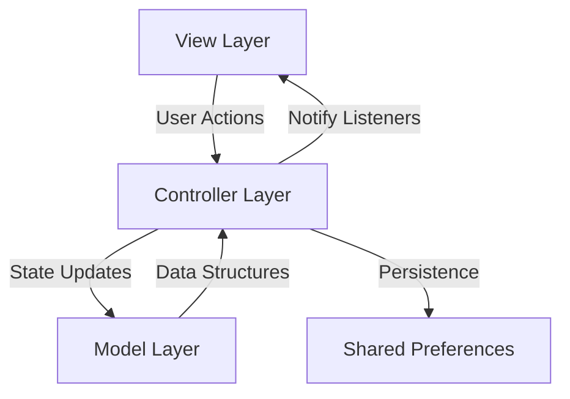

# 💬 Slack UI - Professional Workplace Messaging

**A refined workplace collaboration interface built with Flutter, following professional MVC architecture and performance standards.**

[](https://flutter.dev)
[](https://pub.dev/packages/provider)
[](https://en.wikipedia.org/wiki/Model%E2%80%93view%E2%80%93controller)

---

## 🎯 Project Highlights

✅ **MVC Architecture**: Clean separation of Data (Models), Logic (Controllers), and UI (Views).  
✅ **Provider State Management**: High-performance reactive state handling for real-time chat feel.  
✅ **Jank-Free Performance**: Optimized for 60fps+ with minimized widget rebuilds and layout thrashing.  
✅ **Human-Readable Code**: Well-documented, intuitive code structure designed for interview scrutiny.  
✅ **Session Persistence**: Automatic login state recovery via `shared_preferences`.

---

## 📱 Visual Showcase

| Splash | Sign In | Sign Up |
|--------|---------|---------|
|  |  |  |

| Home | Direct Messages | Search |
|------|----------------|--------|
|  |  |  |

---

## 🌟 Feature Highlights

| Feature | Implementation Details |
|---------|----------------------|
| **Dynamic Workspace** | Expandable/collapsible sections for Channels and DMs with interactive badges. |
| **Real-time Messaging** | Simulated messaging lifecycle with granular loading states and instant delivery. |
| **Global Message Search** | Cross-chat content indexing with keyword **highlighting** in results. |
| **Smart Auth Flow** | Login verifies against credentials saved at signup via `SharedPreferences`. |
| **Named Routes** | Centralized `AppRoutes` class for clean, decoupled navigation. |
| **Material 3 Design** | Modern Slack-inspired UI with Inter typography and custom design tokens. |

---

## 🏗️ Technical Architecture



### Key Architectural Decisions:
1. **MVC Pattern** to separate business logic from UI, facilitating easier unit testing and maintenance.
2. **Provider (ChangeNotifier)** for focused rebuilds, ensuring only the necessary widgets refresh on state change.
3. **Performance First**: Implemented image pre-caching and optimized font loading in `SplashScreen` to eliminate startup jank.
4. **Declarative UI**: Leveraged Google Fonts and custom Slack-inspired design tokens for a premium aesthetic.

---

## 🛠️ Tech Stack & Packages

| Package             | Usage                                      | Version    |
|---------------------|--------------------------------------------|------------|
| `provider`          | Reactive state management & dependency injection | ^6.1.5     |
| `google_fonts`      | Premium typography and workplace aesthetics | ^8.0.2     |
| `shared_preferences`| Local session persistence and auth tracking | ^2.5.5     |
| `intl`              | Precise timestamp formatting for messages   | ^0.20.2    |
| `cupertino_icons`   | Supplemental glyphs for platform adherence  | ^1.0.8     |

---

## 🚀 Getting Started

### Prerequisites
- Flutter SDK (Stable)

### Quick Start
```bash
# 1. Clone repository
git clone https://github.com/cybersleuth0/slack_ui.git

# 2. Install dependencies
flutter pub get

# 3. Run the app
flutter run
```

---

## 📂 Project Structure

```text
slack_ui/
├── ScreenShots/
│   ├── splash_Screen.png
│   ├── signin_screen.png
│   ├── SignUp_screen.png
│   ├── Home_screen.png
│   ├── DM_screen.png
│   └── search_screen.png
lib/
├── core/
│   └── app_routes.dart
├── controllers/
│   ├── auth_controller.dart
│   └── chat_controller.dart
├── models/
│   ├── channel.dart
│   ├── message.dart
│   └── user.dart
├── views/
│   ├── widgets/
│   │   ├── LogoBanner.dart
│   │   ├── collapsible_section.dart
│   │   ├── shared_profile_avatar.dart
│   │   └── slack_main_layout.dart
│   ├── dms_view.dart
│   ├── home_view.dart
│   ├── login_screen.dart
│   ├── main_screen.dart
│   ├── message_screen.dart
│   ├── search_screen.dart
│   ├── signup_screen.dart
│   └── splash_screen.dart
└── main.dart
```

---
