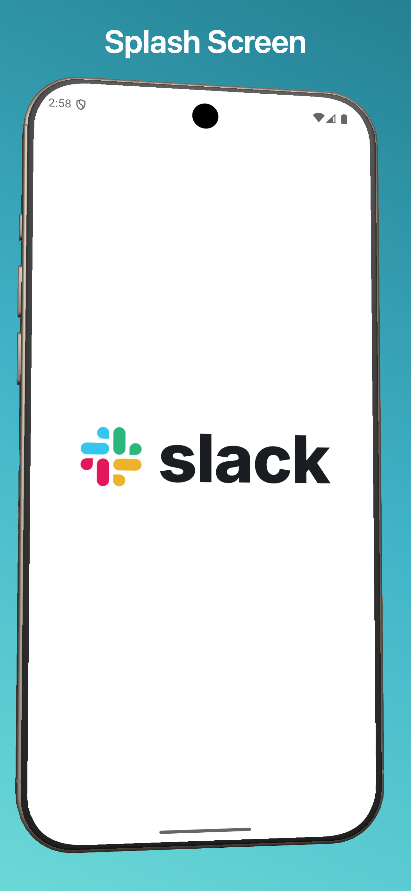
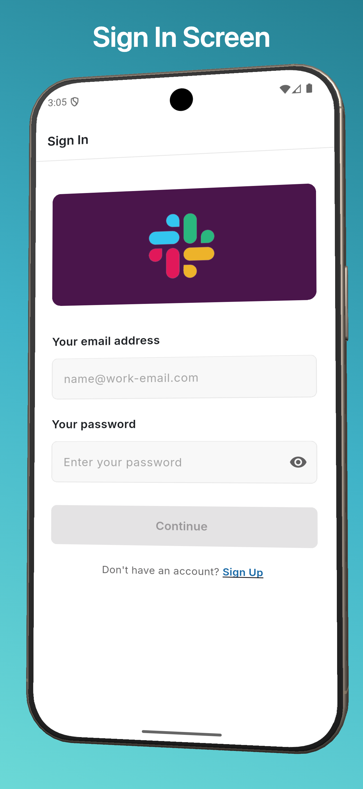
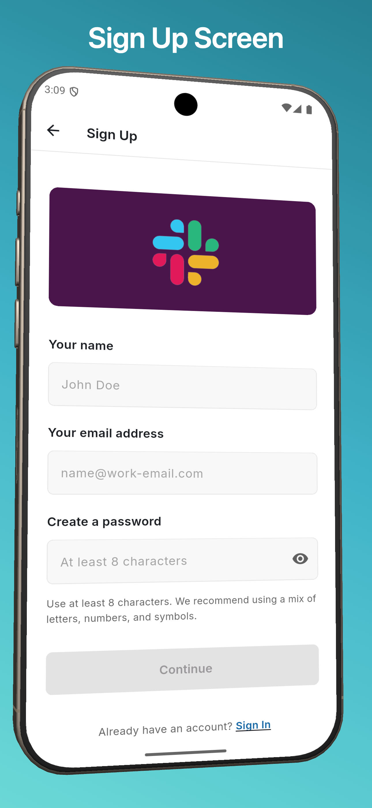
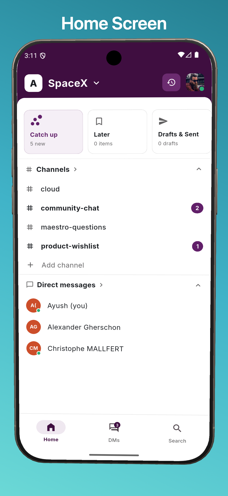
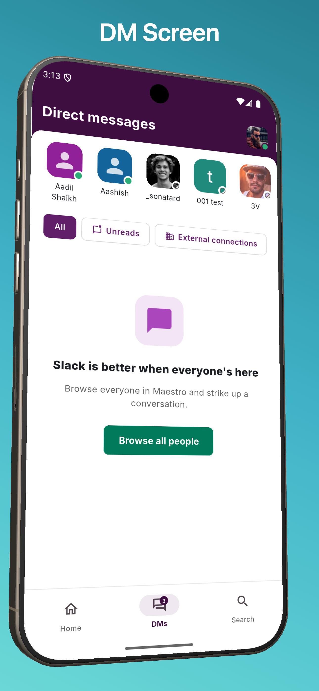
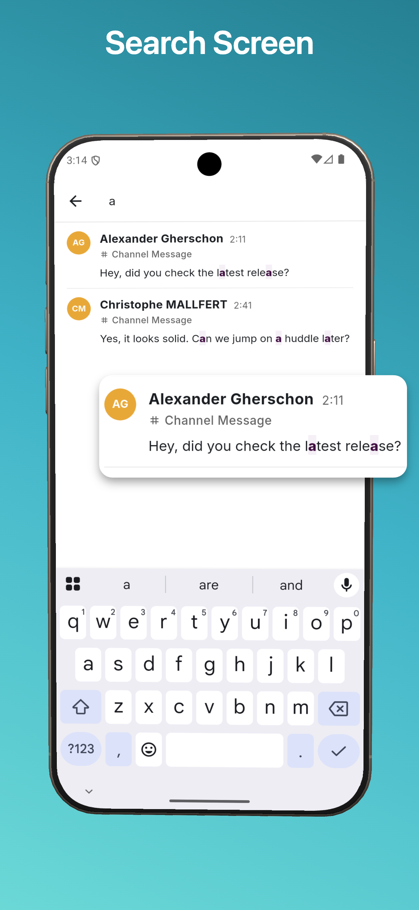
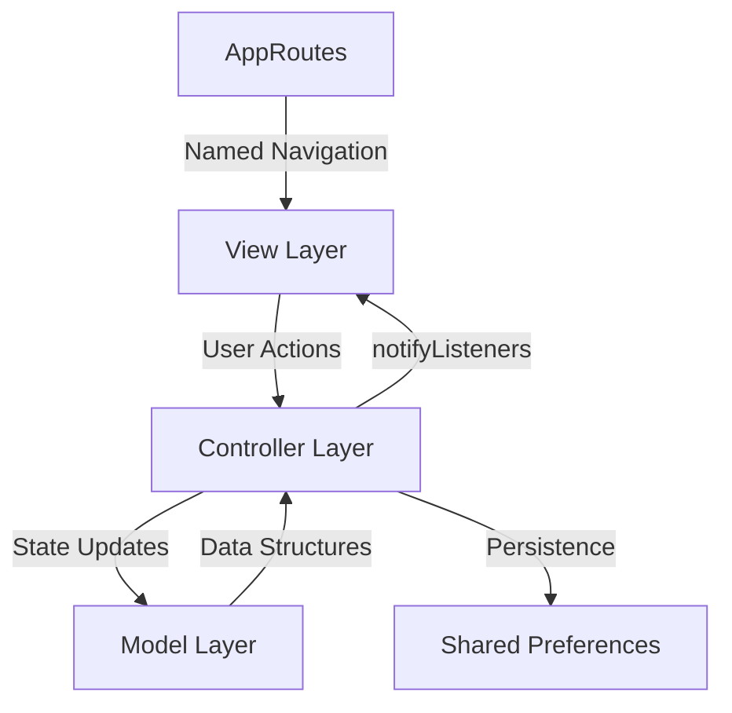

# 💬 Slack UI - Professional Workplace Messaging

**A refined workplace collaboration interface built with Flutter, following professional MVC architecture and performance standards.**

[](https://flutter.dev)
[](https://pub.dev/packages/provider)
[](https://en.wikipedia.org/wiki/Model%E2%80%93view%E2%80%93controller)
[](https://github.com/cybersleuth0/slack_ui/raw/main/releases/slack_ui.apk)

---

## 📥 Download & Install

> **For Interviewers**: Download and install the APK directly on any Android device. No internet required — fonts are bundled locally.

[⬇️ **Download slack_ui.apk** (19.9 MB)](https://github.com/cybersleuth0/slack_ui/raw/main/releases/slack_ui.apk)

> ℹ️ Enable **"Install from unknown sources"** in Android Settings before installing.

---

## 🎯 Project Highlights

✅ **MVC Architecture**: Clean separation of Data (Models), Logic (Controllers), and UI (Views).  
✅ **Provider State Management**: Granular `context.select` for minimal widget rebuilds.  
✅ **Real Credential Validation**: Signup saves credentials; login verifies them via `SharedPreferences`.  
✅ **Named Routes**: Centralized `AppRoutes` class — no screen imports another screen directly.
---

## 📱 Visual Showcase

| Splash | Sign In | Sign Up |
|--------|---------|---------|
|  |  |  |

| Home | Direct Messages | Search |
|------|----------------|--------|
|  |  |  |

---

## 🌟 Feature Highlights

| Feature | Implementation Details |
|---------|----------------------|
| **Dynamic Workspace** | Expandable/collapsible sections for Channels and DMs with unread badges. |
| **Real-time Messaging** | In-memory messaging with `Consumer<ChatController>` for targeted rebuilds. |
| **Global Message Search** | Cross-chat content search with keyword **highlighting** using `RichText`. |
| **Smart Auth Flow** | Signup saves email + password; login checks against stored credentials. |
| **Active Highlighting** | Selected channel/DM turns purple via `activeChatId` state in controller. |
| **Named Routes** | `AppRoutes.onGenerateRoute` handles all navigation with typed argument passing. |
| **Offline Fonts** | Inter font family bundled as TTF assets — no `fonts.gstatic.com` calls. |

---

## 🏗️ Technical Architecture



### Key Architectural Decisions:
1. **MVC Pattern**: Business logic in Controllers, data in Models, pure UI in Views.
2. **Provider (ChangeNotifier)**: `context.select` for pinpoint rebuilds — only affected widgets redraw.
3. **Named Routes**: `AppRoutes` class decouples all screens — no circular imports.
4. **Offline-First Fonts**: `GoogleFonts.config.allowRuntimeFetching = false` + bundled TTF files.

---

## 🛠️ Tech Stack & Packages

| Package              | Usage                                           | Version    |
|----------------------|-------------------------------------------------|------------|
| `provider`           | Reactive state management & dependency injection | ^6.1.5     |
| `google_fonts`       | Font API (Inter bundled locally as TTF assets)  | ^8.0.2     |
| `shared_preferences` | Session persistence & credential storage        | ^2.5.5     |
| `intl`               | Timestamp formatting for messages               | ^0.20.2    |
| `cupertino_icons`    | Supplemental platform icons                     | ^1.0.8     |

---

## 🚀 Getting Started

### Prerequisites
- Flutter SDK (Stable)

### Quick Start
```bash
# 1. Clone repository
git clone https://github.com/cybersleuth0/slack_ui.git

# 2. Install dependencies
flutter pub get

# 3. Run the app
flutter run
```

---

## 📂 Project Structure

```text
slack_ui/
├── ScreenShots/               # UI screenshots for README
├── assets/
│   ├── fonts/                 # Bundled Inter TTF files (offline-ready)
│   └── images/                # App assets (Slack logo etc.)
├── releases/
│   └── slack_ui.apk           # Release APK v1.1
lib/
├── core/
│   └── app_routes.dart        # Centralized named route definitions
├── controllers/
│   ├── auth_controller.dart   # Login, signup, session management
│   └── chat_controller.dart   # Messages, channels, DMs, search
├── models/
│   ├── channel.dart
│   ├── message.dart
│   └── user.dart
├── views/
│   ├── widgets/
│   │   ├── LogoBanner.dart
│   │   ├── collapsible_section.dart
│   │   ├── shared_profile_avatar.dart
│   │   └── slack_main_layout.dart
│   ├── dms_view.dart
│   ├── home_view.dart
│   ├── login_screen.dart
│   ├── main_screen.dart
│   ├── message_screen.dart
│   ├── search_screen.dart
│   ├── signup_screen.dart
│   └── splash_screen.dart
└── main.dart
```

---
